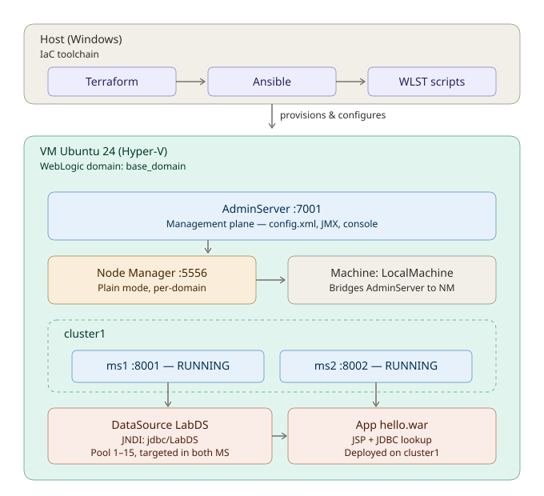

# WebLogic 14c Cluster Lab — IaC do zero ao deploy

> Lab de infraestrutura como código (IaC) que provisiona e configura um ambiente WebLogic 14.1.1 completo num único comando: VM, JDK, domínio, cluster, Data Source e aplicação JEE rodando. Pensado como referência pessoal de aprendizado e como portfólio para posições de sustentação/DevOps em stacks Oracle Middleware.

[](.github/workflows/ci.yml)
[](.github/workflows/ci.yml)
[](https://www.oracle.com/middleware/weblogic/)
[](LICENSE)

---

## O que este repo faz

Em um `make up`:

1. **Terraform** cria uma VM Ubuntu 24.04 no Hyper-V local (4 vCPU, 8GB RAM, 40GB disco), configura rede e injeta SSH via cloud-init.
2. **Ansible** entra na VM via SSH e instala JDK 11, WebLogic 14c (a partir do instalador local) e dependências.
3. **WLST** (scripts Python rodando no WebLogic) cria o domínio, Node Manager, AdminServer, dois Managed Servers (`ms1`, `ms2`), Machine, Cluster e um Data Source apontando pro Derby embutido.
4. **Deploy** de uma aplicação JSP que consulta o banco via JNDI → Connection Pool → Derby e renderiza o resultado em HTML.
5. **Output** do Terraform mostra a URL final: `http://<vm-ip>:8001/hello/`

E em um `make down`: destrói a VM e limpa o estado.

## Arquitetura



```
┌─ Windows Host ─────────────────────────────────────────────┐
│                                                            │
│  terraform ──► Hyper-V ──► VM Ubuntu                       │
│      │                         │                           │
│      └─ provisioner ──► ansible (SSH)                      │
│                                │                           │
│                                ▼                           │
│                        ┌───────────────────┐               │
│                        │  WebLogic Domain  │               │
│                        │                   │               │
│                        │  ┌─────────────┐  │               │
│                        │  │ AdminServer │  │               │
│                        │  │   :7001     │  │               │
│                        │  └──────┬──────┘  │               │
│                        │         │         │               │
│                        │  ┌──────┴──────┐  │               │
│                        │  │NodeManager  │  │               │
│                        │  │   :5556     │  │               │
│                        │  └──────┬──────┘  │               │
│                        │         │         │               │
│                        │    ┌────┴────┐    │               │
│                        │    │ cluster1│    │               │
│                        │    └─┬─────┬─┘    │               │
│                        │   ┌──┘     └──┐   │               │
│                        │ ┌─▼──┐     ┌──▼─┐ │               │
│                        │ │ms1 │     │ms2 │ │               │
│                        │ │8001│     │8002│ │               │
│                        │ └─┬──┘     └─┬──┘ │               │
│                        │   │          │    │               │
│                        │   └────┬─────┘    │               │
│                        │        │          │               │
│                        │  ┌─────▼──────┐   │               │
│                        │  │ DataSource │   │               │
│                        │  │  LabDS     │   │               │
│                        │  │ (pool 1-15)│   │               │
│                        │  └─────┬──────┘   │               │
│                        │        │          │               │
│                        │  ┌─────▼──────┐   │               │
│                        │  │ Derby      │   │               │
│                        │  │ :1527      │   │               │
│                        │  │ labdb      │   │               │
│                        │  └────────────┘   │               │
│                        └───────────────────┘               │
└────────────────────────────────────────────────────────────┘
```

## Stack

| Camada | Ferramenta | Por quê |
|---|---|---|
| Provisionamento de VM | **Terraform** + provider `taliesins/hyperv` | IaC declarativo, estado versionado |
| Configuração do SO + runtime | **Ansible** | Idempotente, sem agente, roda via SSH |
| Configuração do WebLogic | **WLST** (Python) | Ferramenta oficial Oracle, é o que produção usa |
| Aplicação de demo | **JSP + JDBC** | Stack JEE clássica, prova o ciclo completo |
| CI | **GitHub Actions** | Validação de sintaxe/lint (execução é local) |

## Quick start

### Pré-requisitos

- Windows 10/11 com Hyper-V habilitado
- Terraform >= 1.6
- Ansible >= 2.15 (WSL ou nativo)
- OpenSSH client
- Instalador do WebLogic 14.1.1 (`fmw_14.1.1.0.0_wls_lite_generic.jar`) em `binaries/`
- Ubuntu 24.04 cloud image (`.img`) em `binaries/`

> O binário do WebLogic **não** está no repositório por licença Oracle e tamanho. Baixe em [oracle.com/middleware/weblogic](https://www.oracle.com/middleware/weblogic/technologies/downloads.html) (requer conta Oracle, licença gratuita para desenvolvimento).

### Subir tudo

```bash
# Clone e entra
git clone https://github.com/<seu-user>/weblogic-14c-cluster-lab.git
cd weblogic-14c-cluster-lab

# Configure variáveis
cp terraform/terraform.tfvars.example terraform/terraform.tfvars
# edite o tfvars: caminho do VHDX, binário WebLogic, senha inicial

# Sobe tudo
make up

# Ao final:
# Outputs:
#   admin_url = "http://192.168.x.x:7001/console"
#   app_url   = "http://192.168.x.x:8001/hello/"
```

### Comandos disponíveis

| Comando | O que faz |
|---|---|
| `make up` | Ciclo completo: VM + WebLogic + app |
| `make down` | Destrói a VM e limpa estado do Terraform |
| `make vm-only` | Só provisiona a VM (sem Ansible) |
| `make configure` | Só roda Ansible numa VM já existente |
| `make deploy-app` | Só refaz deploy da app |
| `make health` | Roda health-check em todos os endpoints |
| `make ssh` | SSH direto na VM |
| `make console` | Abre o Admin Console no browser |
| `make logs` | Tail dos logs dos Managed Servers |

## Validações (health-check)

`make health` verifica:

- ✅ AdminServer respondendo em `:7001/console`
- ✅ Managed Server `ms1` respondendo em `:8001`
- ✅ Managed Server `ms2` respondendo em `:8002`
- ✅ App `/hello/` retornando HTTP 200 nos dois MS
- ✅ Data Source `LabDS` testando com sucesso em ambos os servers
- ✅ Cluster `cluster1` com 2 membros em estado `RUNNING`

## Documentação adicional

- [**Arquitetura detalhada**](docs/01-architecture.md) — componentes, fluxos de rede, portas
- [**Troubleshooting log**](docs/02-troubleshooting-log.md) — problemas reais que enfrentei construindo esse lab, com causa-raiz e solução
- [**WLST cookbook**](docs/03-wlst-cookbook.md) — snippets úteis para operação diária

## Conhecimento demonstrado

Este repositório comprova experiência prática com:

### WebLogic Administration
- Criação de domínio from scratch via WLST
- Configuração de Node Manager per-domain em modo Plain
- Criação e associação de Machines, Managed Servers e Clusters
- Configuração de Data Sources (Generic, com pool tunado)
- Deploy/redeploy de aplicações JEE com targeting em cluster
- Troubleshooting em camadas (NM log → server .out → config.xml)

### IaC & Automation
- Terraform para provisionamento de VMs
- Ansible para configuration management idempotente
- WLST scripting em Python (offline e online)
- Makefiles para orquestração de pipelines locais
- CI com validação de sintaxe (Terraform fmt/validate, ansible-lint, yamllint)

### JEE & Observabilidade
- JSP com lookup JNDI de DataSource
- Connection pooling e análise de estatísticas de pool
- Deploy de WAR em cluster com balanceamento
- Simulação de falhas e recovery via AutoRestart do Node Manager

## Licença

MIT — veja [LICENSE](LICENSE). O binário do WebLogic é propriedade da Oracle e não é redistribuído.

## Autor

Lucas — Production Analyst, focado em middleware Oracle e plataformas de alta disponibilidade.
